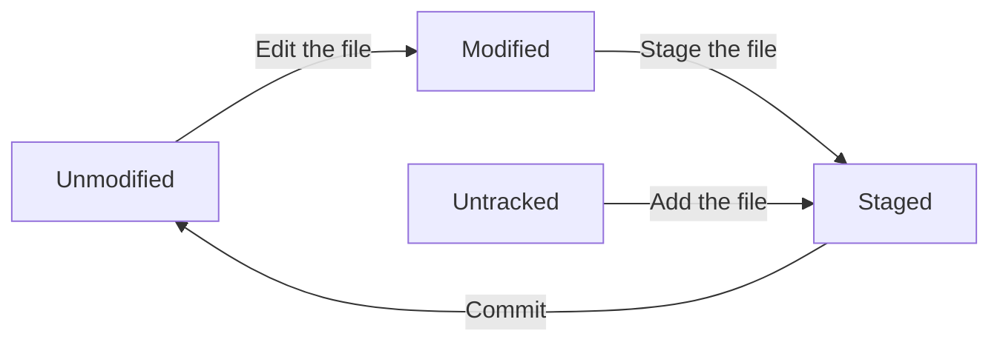
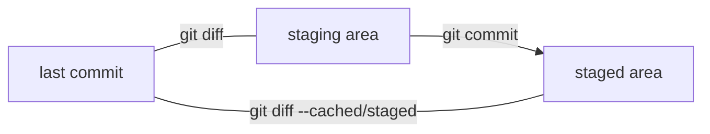

# Git Basic
[TOC]
## Getting a Git Repository ##

### Initializing a Repository  ###

* initializing a repository in an existing directory
```
$ git init 
$ git add
$ git commit -m'<text>'
```

### Cloning an Existing Repository

* cloning  an existing repository
```
$ git clone <url> <filename>
### use git:// protocol often
```

## Recording changes to the repository

* tracked files: in your last snapshot, modified, unmodified or staged, git knows it.
* untracked files: not in your last snapshot or in the staged area.



 
### Checking status for your files

* which files are in which status

```bash
$ git status
On branch master
Your branch is up-to-date with 'origin/master'.
nothing to commit, working tree clean
status
```

* Git also has a short status flag **git status -s** or **git status -short** you get a simplified output.

```
$ git status -s
 M README
MM Rakefile
A  ...
M  ...
?? ...
```

The left-hand column indicates the status of the staging area and the right-hand column indicates the status of the **working tree**.

[blank]M 
: modified but not yet staged

MM
: modifeid and staged but modified again

A 
: not modified in staged area

M 
: modified and staged

??
: not tracked

### Ignoring Files ###

By create a file listing patterns to match which you don't want to track, named **.gitignore**.  
Here is an example.

```
$ cat .gitingnore

# ignore all .a/.o files
*.[oa]

# but do track lib.a, even ignoring .a files above
!lib.a

# only ignore the todo file in the current directory, not subdir/todo 
/todo 

# ignore all files in any directory named build
build/

# ignore doc/notes.txt, but not doc/server/arch.txt 
doc/*.txt

# ignore all .pdf files in the doc/directory and any of its subdirectories
doc/**/*.pdf
```

The rules for the patterns:  
- blank lines or lines starting with **#** are ignored.
- Standard glob patterns work, and will be applied recursively throughout the entire working tree.
- Start patterns with a forward slash ( **/** ) to avoid recursivity.
- End patterns with a forward slash ( **/** ) to specify a derectory.
- negate a pattern by starting it with an exclamation point ( **!** ).

Glob patterns are like simplified regex expressions that shell use:
- An asterick (*) matches zrto or more characters.
- **[abc]** matches any character inside the brackets.
- A question mark **?** matches a single character.
- brackets enclosing characters separated by a hyphen ( **[0-9]** ) matches any character between them.
- Use two asterisks to match nested directories; a/**/z would match a/z, a/b/z, a/b/c/z, and so on.

> A repository might have a single **.gitignore** file in its root directory which applies recursively to the entire repository. 
> However the additional **.gitignore** files in subdirectories whose rules in the nested files apply only too the files under the directory where they are located.
> For more detailed information, please check **man gitignore** for the details.

### Viewing your Staged and Unstaged Changes ###
- What have you changed but not yet staged?
- What have you staged that you are about to commit?  
For these, **git diff** shows you the exact lines added and removed -- the patch, as it were.

**git diff** compare what is in your working derectory with what is in your staging area. The result tells you the changes you've made that you haven't yet staged.

**git diff --staged** compares your staged changes to your last commit, shows what you've staged that will go into your next commit. **git diff --cached** to see what you've staged so far (--staged and --cached are synonyms).



> git difftool

### Committing Your Changes ###
**git add** stays before the **git commit** which staged the modified files which move files from working flow to staged area.

```
$ git commit
```
doing so lauches your editor of choice. You can see that the default commit message contains the latest output of the **git status** command commented out and one empty line on top. 

> **git commit -v** puts the diff of your change in the editor do you can see exactly what changes you're committing.

Alternatively, you cantype your commit message inline with the **git commit -m**.  
The commit records the snapshot you set up in your staging area. Every time you [erform a commit, you're recording a snapshot of your project that you can revert to or compare to later.

### Skipping the Staging Area ###
**git commit -a** makes Git automatically stage every file that is already tracked before doing the commit, letting you skip the **git add** part.

However, the command ignores the untracked new files.

### Removing Files ###
**git rm** command reomve a file from staging area and thencommit (from tracked files) and from your working directory. 

**git rm -f** removes the modified file or staged file.

**git rm -cached** removes files from your staging area but keeps it in your working tree.

Pass files, directories and file-glob patterns to the **git rm** command like:
```
$git rm log/\*.log
```
The backslash ( **\** ) makes Git own filename expansion ina ddtion to shell's filename expansion.  
The command removes all files that have the **.log** extension in the **log/** directory.

```
$git rm \*~
```
The command removes all files whose names end with a ~.

### Moving Files ###

Renaming files using moving files method:
```
$ git mv file_from file_to
which is equivalent to
$ mv file_from file_to
$ git rm file_from
$ git add file_to
```

## Viewing the Commit History ##
> output formatting options
- **git log** show the commit history of a repository.  
- **git -p/-patch** shows the difference (the patch output) introduced in each commit.  
- **-n** limits the number of log entries displayed to num entries.  
- **--stat** option show the abbreviated stats for each commit. 
    - how many files were changed.
    - how many lines in those files were added and removed.
    - a summary of the information at the end.
- **--pretty** option changes the log output to formats other than the default. Here are a few prebuilt option values available to use.
    - **online** value prints on a single line.
    - **short**, **full**, **fuller** show the output with less or more information.
    - **format** specify your own log output, see more detail in progit.
    - with another **log** option called **--graph** shows your brach and merge history.

### Limiting Log Output ###
> options let you show only a subset of commits.
continued...

## Undoing Things ##

If you want to redo the commit, make the additional changes you forgot, stage them, and commit again using the **amend** option:
```
$git commit --amend
```
The commit-message editor fires up and you can edit the message as usual which overwrites your previous commit.  
You improved the former commit which is never happened.

### Unstaging a Staged File ###
### Unmodifying a modified File ###
### Undoing things with git restore ###

## Working with Remotes ###
### Showing Your Remotes ##

**git remote** command lists the shortnames of each remote handle you've specified.  
**-v** option shows the URL.

### Adding Remote Repositories ###
```
$ git remote add <shortname> <url>
```
usually the **origin** serve as the shortname

### Fetching and Pulling from Your Remotes ###
To get data from your remote projects, you can run:
```
$ git fetch <remote>
```
To get the remote branch merged into your current branch:
```
$ git pull
```
> Recommend the *git fetch*, with which you can merge the difference between your codes manually.
### Pushing to Your Remotes ###
```
$ git push <remote> <branch>
```
- If the very first time to push the code, you are supposed to rewrite as:
```
$ git push -u <remote> <branch>
```

### Inspecting a Remote ###
See more information about a particuler remote:
```
$ git remote show <remote>
```


