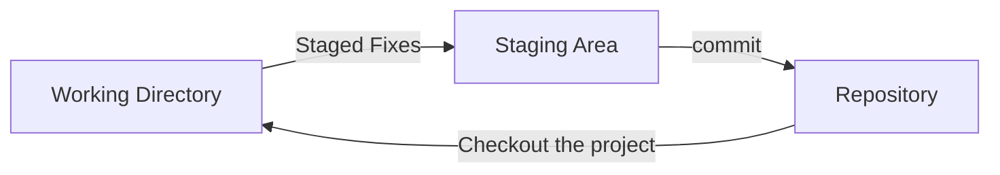

# An introduction to git

## characteristics of git

- Characteristics of Git 
    - snap shots, not differnce.
    - local operation.
    - integrity: hash value to checksum.
    - only add data. 

- Three states
    - modified: changed but not committed.
    - staged: marked a modified to next snapshot version.
    - committed: stored in the local database.

- Three sections
    - working tree: a single checkout of one version of the project.
    - staging area: a file stores information to go into your next commit.
    - git directory : stores metadata and object database.

---

---

1. modify files in your working tree.
2. stage and add the changes to staged area.
3. store the staged snapshot into your repository.

## Git setup

1. git config: print the help page and instructions.
    - view all of your settings and where it is from.
```
  git config -l --show-origin
```
2. identity
    - username
    - email
3. editor
4. default branch name

 
## Git help

- There are three ways to get help

``` 
  git help <verb>
  git <verb> --help
  man git-<verb>
```

- or we can ask for a brief help with -h:

``` 
  git <verb> -h
```


  
  
