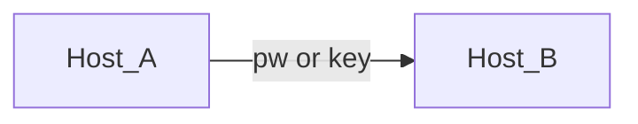
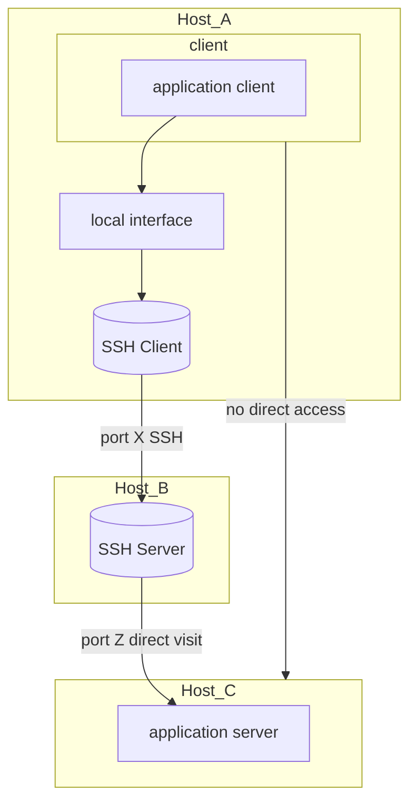
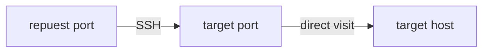

# SSH Port Forwarding

## basic link

- The SSH basic command is:

```bash
ssh username@hostname
```



> username
> : username on Host_B logined

> hostname 
> : device, domain name or IP address on Host_B which located on Internet

## Local Forwarding

- [ appliction client ] access quest ~~[ A --> C/Z ]~~
- [ Host_A port_X --> Host_B ] 
- [ Host_B --> Host_C port_Z ] [ application server ]

the port forwarding command:
```bash
ssh -L Host_A/port_X : Host_C: Host_C/port_Z username@hostname
ssh -L [ receive interface: ] receive port: target host: target port username@hostname
ssh -p port_X hostname_C@localhost
# visit A:X into C:Z 
```
After the local forwarding command, we execute the visit proposal command **ssh -p**





C provide [ application server ] on one port, while Host_A can't visit C or the port. With SSH: A-->B and B can directly visit port on C. The local forwarding matters.

Access quest occurs from Host_A, which can be A itself or any device linked to A visiting the port from A to B.

> -L
> : select [local forwarding] 

> 
