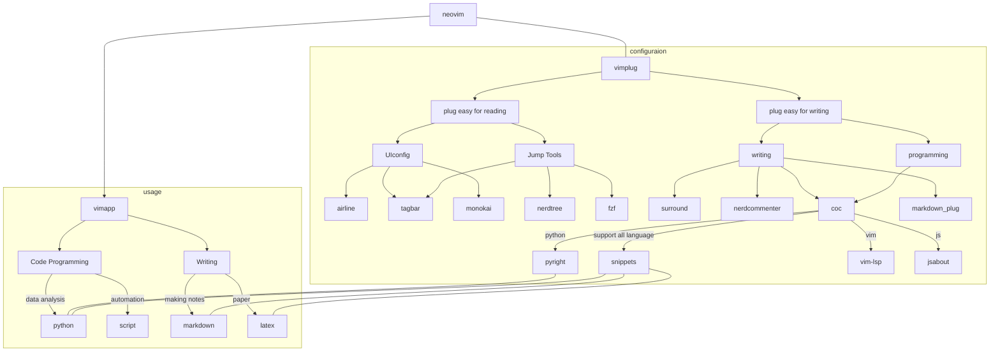

# Vim work tree #

- Working Tree for editing files

```mermaid

graph TB
    vim[neovim] --> vimapp
    vim --- vimplug
    subgraph usage
        vimapp --> code[Code Programming]
        vimapp --> note[Writing]
        code --> |data analysis| python  
        code --> |automation| script
        note --> |making notes| markdown 
        note --> |paper| latex
        
    end
%% 
    subgraph configuraion
        vimplug --> rp[plug easy for reading]
        vimplug --> wp[plug easy for writing]
        rp --> uc[UIconfig]
        rp --> jt[Jump Tools]
        uc --> airline & tagbar & monokai
        jt --> nerdtree & tagbar & fzf
        wp --> writing & programming
        writing --> surround & nerdcommenter & coc & markdown_plug
        programming --> coc
        coc --> |support all language| snippets
        coc --> |python| pyright
        coc --> |vim| vim-lsp
        coc --> |js| jsabout
        pyright --- python
        snippets --- markdown & latex & python

    end
```

